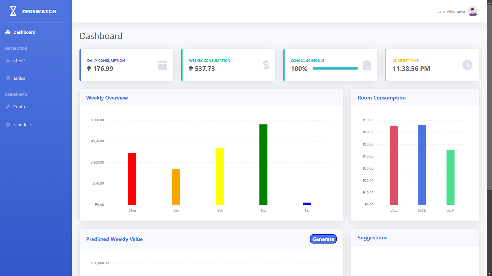

# ZeusWatch - An Energy Efficiency Framework 

$${\color{#4e73df}ZeusWatch}$$ is an Energy Efficiency Framework for $${\color{red}Technological \space University \space of\space the \space Philippines \space - \space Visayas}$$

## Introduction 

Energy efficiency is essential for schools due to high energy consumption, rising costs, and environmental concerns, but challenges like outdated infrastructure and the lack of real-time monitoring make management difficult. The Internet of Things (IoT) can improve energy management by connecting devices to collect real-time data, enabling automatic control, identifying inefficiencies, and supporting predictive maintenance. This study aims to bridge the research gap in energy management for academic institutions, providing insights for implementing smart campus technology and helping policymakers and administrators enhance efficiency while reducing costs.

## Preview

## Bugs and Issues

Have a bug or an issue with this framework? [Open a new issue](https://github.com/Mooyi07/ZeusWatch/issues) here on GitHub.

## About

The objective of $${\color{#4e73df}ZeusWatch}$$ is to $${\color{#f6c23e}predict}$$ and $${\color{green}analyze}$$ using the collected IoT data. Schools are notable energy consumers, and a significant amount of this energy is lost due to ineffective management and usage practices.  The current energy management systems in schools often lack immediate monitoring and intelligent control, resulting in unnecessary consumption and higher operational expenses.  Due to excessive carbon emissions. This inefficiency impacts the financial budgets of schools and worsens environmental problems.

* <https://github.com/Mooyi07/ZeusWatch>

$${\color{#4e73df}ZeusWatch}$$  was created by and is maintained by **[Lanz Joseph T. Villanueva](https://www.facebook.com/mooyi07)**.

* <https://www.facebook.com/mooyi07>
* <https://mooyi.pages.dev/>
* <https://github.com/Mooyi07>

$${\color{#4e73df}ZeusWatch}$$  framework is created by [Lanz Joseph T. Villanueva](https://www.facebook.com/mooyi07) and [Crhiz Q. Salillas](https://www.facebook.com/crhiz15).

## Copyright

Copyright &copy; $${\color{#4e73df}ZeusWatch}$$ 2024
